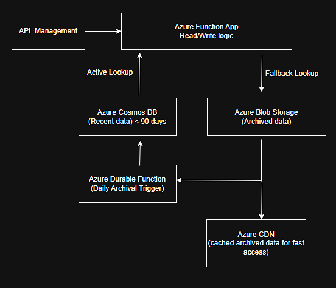

# 🔍 Cost Optimization in Azure Serverless Billing System

## Problem Statement

We manage a read-heavy serverless architecture in Azure that stores billing records in Cosmos DB. As usage grows, cost increases due to DB size and query overhead. Billing records older than 3 months are rarely accessed, creating an opportunity to optimize.

## Goals

- Reduce Cosmos DB costs by offloading stale data
- Maintain API contracts and response latency
- Zero data loss, zero downtime during transition
- Easy to deploy and maintain architecture

---

## Final Architecture



### Components

- **Azure API Management** – preserves existing API contracts
- **Azure Functions** – read/write logic with archival fallback
- **Azure Cosmos DB** – stores recent billing records (<90 days)
- **Azure Durable Functions** – scheduled archival orchestration
- **Azure Blob Storage** – low-cost archived record storage
- **Azure CDN** – caches archived data for fast global retrieval

---

##  Key Features

- Automatic archival of records older than 90 days
- Seamless fallback logic from Cosmos DB to Blob Storage
- Blob lifecycle rules to shift data to cooler tiers
- CDN acceleration for slow blob tier latency
- Monitoring via Application Insights and synthetic tests

---

##  File Structure

| Folder/File | Purpose |
|-------------|---------|
| `docs/` | Architecture diagram |
| `infra/` | Terraform configs |
| `functions/` | Archival and read logic |
| `README.md` | Solution overview |

---

##  Failure Modes & Mitigations

| Failure Point | Mitigation Strategy |
|---------------|---------------------|
| Blob latency  | CDN cache & async fallback |
| Archival job crash | Durable retries + DLQ |
| Data corruption | Blob versioning + Cosmos backups |
| High traffic | Function scaling + queued writes |
| Monitoring blind spots | Synthetic reads + OpenTelemetry |
| Terraform drift | CI/CD enforcement & state locking |

---

## Bonus: CDN Integration

Archived records are served via Azure Blob Storage and accelerated via CDN for global low-latency access. Cache-control headers are applied at upload.

```python
blob.upload_blob(
    f"{record['id']}.json",
    json.dumps(record),
    content_settings=ContentSettings(content_type='application/json', cache_control='public, max-age=86400')
)
